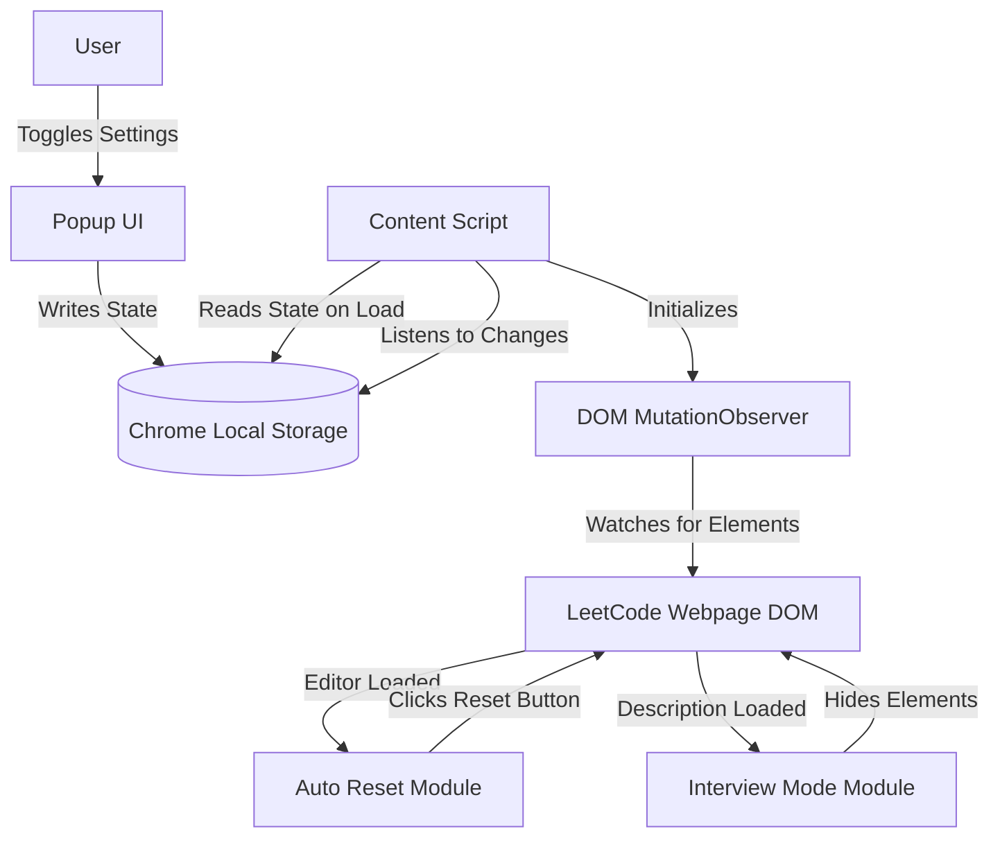

# LeetCode Assistant

LeetCode Assistant is a lightweight, modern browser extension designed to optimize the problem-solving and interview preparation experience on LeetCode. By eliminating distractions and automating repetitive tasks, it helps developers focus entirely on their logic and problem-solving skills.

## The Problem

When preparing for technical interviews on LeetCode, developers face two common friction points:

1. **Repetitive Editor Resetting**: Revisiting a previously solved problem for spaced repetition often means manually finding and clicking the reset button, or manually highlighting and deleting code before being able to practice again.
2. **Over-reliance on Constraints and Examples**: Real technical interviews rarely provide all test cases, examples, and constraints upfront. However, LeetCode prominently displays these, which can unintentionally train developers to rely on them rather than asking clarifying questions or identifying edge cases independently.

## The Solution

This extension bridges the gap between casual practice and realistic interview environments by providing toggleable features directly from a minimalist popup menu:

- **Auto Reset Code**: Automatically clears the code editor to a blank slate the moment a problem is loaded, saving time and ensuring a fresh start.
- **Interview Mode**: Dynamically hides examples, hints, and problem constraints from the description, forcing the user to deduce edge cases and build a robust mental model of the problem.

## Architecture

The extension is built using a modern content-script injection architecture. State is synchronized seamlessly across the extension components.



### Component Breakdown

- **Popup UI**: A React-based interface where users toggle their preferred features. It instantly updates the extension's local storage.
- **State Management**: Utilizes the `chrome.storage.local` API to persist user preferences.
- **Content Script**: The core engine injected into LeetCode pages. It leverages `MutationObserver` to reliably detect when LeetCode's Single Page Application (SPA) renders the editor or problem description, regardless of network speed or client-side routing.
- **Feature Modules**: Modular TypeScript files handling specific DOM manipulations (e.g., finding the reset button or hiding specific CSS classes associated with examples).

## Technologies Used

- **Plasmo Framework**: A powerful browser extension framework that handles bundling and manifest generation.
- **React**: Used for building the declarative and responsive Popup UI.
- **TypeScript**: Ensures type safety and robust code architecture across all modules.
- **CSS**: For injecting styles and overriding LeetCode's default UI elements.
- **Chrome Extension APIs**: specifically the Storage API for state persistence and scripting capabilities.

## How to Use (Local Development)

### Prerequisites

Ensure you have Node.js and a package manager like `pnpm` (recommended), `npm`, or `yarn` installed.

### Setup Instructions

1. Clone the repository to your local machine.
2. Navigate to the project directory and install dependencies:
   ```bash
   pnpm install
   ```
3. Start the development server:
   ```bash
   pnpm dev
   ```
4. Open your Chromium-based browser (Chrome, Edge, Brave) and navigate to the extensions page (`chrome://extensions/`).
5. Enable "Developer mode" in the top right corner.
6. Click "Load unpacked" and select the `build/chrome-mv3-dev` folder generated in your project directory.
7. Navigate to any LeetCode problem. Click the extension icon to toggle Auto Reset or Interview Mode.

### Production Build

To create a production-ready zip file for Web Store distribution:

```bash
pnpm build
```

## How to Contribute

Contributions are highly encouraged to expand the feature set of this assistant. 

1. Fork the project repository.
2. Create your feature branch (`git checkout -b feature/NewAssistantFeature`).
3. Commit your changes (`git commit -m 'Add some NewAssistantFeature'`).
4. Push to the branch (`git push origin feature/NewAssistantFeature`).
5. Open a Pull Request detailing the problem it solves and your proposed architecture.

When adding new features, please ensure that you create a separate module in the `features/` directory and tie it into the main content script observer to maintain architectural cleanliness.

## License

This project is open-source and available under the standard MIT License. Feel free to use, modify, and distribute it as needed.
